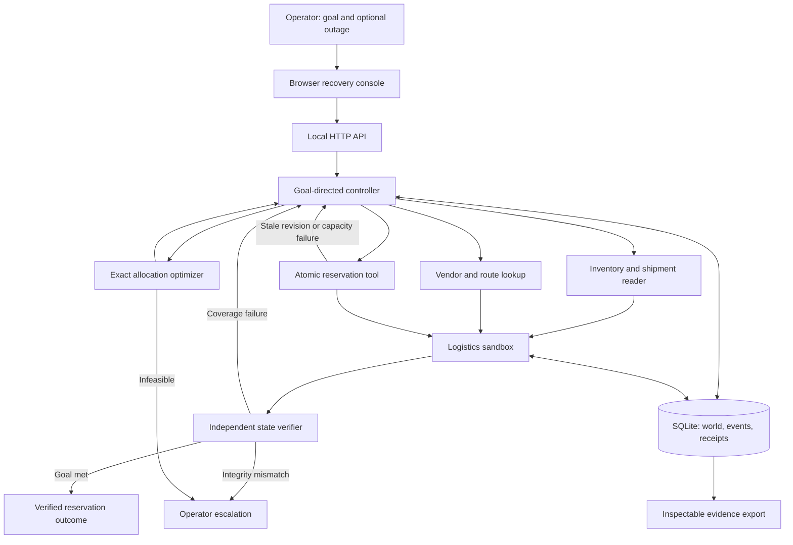

# Architecture and tool contracts

All tool implementations are local functions with explicit input/output objects. HTTP exposes the controller and operator actions, not a separate microservice per tool. Vendor and route data are retrieved from the sandbox catalog; no RAG or external LLM is claimed.

## Planning model

Let x_i be the number of ten-unit lots reserved from offer i. Each offer has capacity s_i, lot cost c_i, lot carbon e_i, availability a_i and ETA t_i. For shortage D, choose nonnegative integer x_i such that:

- 10 * sum(x_i) = D.
- 10 * x_i <= available stock s_i.
- x_i = 0 for unavailable routes or t_i > deadline.
- sum(c_i * x_i) <= remaining budget.
- sum(e_i * x_i) <= remaining carbon allowance.

Lexicographically minimize total cost, then total carbon, then the latest ETA. Existing unaffected reservations consume budget/carbon and reduce the remaining demand before each search. No objective weight is hidden. The exact enumerator considers every feasible lot allocation; complexity is the product of each offer's bounded capacity range. The UI caps initial demand at 200 units and the model has five offers. Larger systems need a scalable integer-programming solver.

## Persistent state and transaction boundary

SQLite stores the current world plus an append-only sequence of structured events. A `BEGIN IMMEDIATE` transaction surrounds each controller step or injected outage. It serializes concurrent changes and saves state and the event together. Connections close explicitly, including on exceptions. Refreshing the UI or restarting Python can resume by run ID.

Reservation execution verifies the expected environment revision, authoritative catalog prices, all capacities and the combined service constraints before mutating anything. It writes orders, inventory deductions, ledger debits and receipts in one persisted transaction. A retry with an existing idempotency key returns the original receipt; using the same key with a different plan is rejected. This is local transactional idempotency, not a claim of distributed exactly-once execution.

## Tool interfaces

| Tool | Inputs | Output / mutation |
|---|---|---|
| `inventory.read + shipment.read` | Current world | Shortage, coverage, delayed shipment and revision |
| `vendor.list + route.lookup` | Current world | Authoritative offers, capacities, ETAs, prices and carbon |
| `allocation.optimize` | Catalog, residual goal, shortage | Exact best plan, candidate counts or infeasibility |
| `logistics.commit` | Plan, expected revision, idempotency key | Atomic reservations or rejection with no partial purchase |
| `environment.close_route` | Offer ID | Closure, cancellation, stock release, refund and new revision |
| `outcome.verify` | Persisted world | Ten checks, recalculated totals and success/failure |

HTTP routes: `GET /api/scenarios`; `POST /api/runs`; `GET /api/runs/{id}`; `POST /api/runs/{id}/step`; `POST /api/runs/{id}/run`; `POST /api/runs/{id}/disrupt` with `{"offer_id":"V2"}`.

## Feedback and stopping

A stale revision restarts observation, rather than blindly retrying the failed allocation. A closed committed route cancels only affected reservations. The next search retains unaffected orders and recovers the remaining shortage. No feasible plan leads to an explicit escalation without a new purchase. An inconsistent ledger, stock record, receipt, order identity or quoted price stops autonomous completion for operator review. A 40-step cap prevents indefinite execution.

Verification recalculates from saved orders and ledger, ignoring cached planner totals. Checks cover quantity, budget, carbon, deadline, open routes, net ledger spend, unique order IDs, stock conservation, authoritative pricing and receipt references. Some utility arithmetic is shared with the planner; the benchmark's dynamic-programming oracle is implemented independently to reduce shared-logic blind spots.

## Trust and limitations

Supplier names are display text; the browser escapes them and no interpreter executes them. All writes remain in the local sandbox. Cross-origin browser writes are rejected, but localhost binding is not production authentication. The prototype does not claim adversarial tamper-proof audit logs, genuine carbon measurement, distributed transaction support, or physical delivery confirmation.
